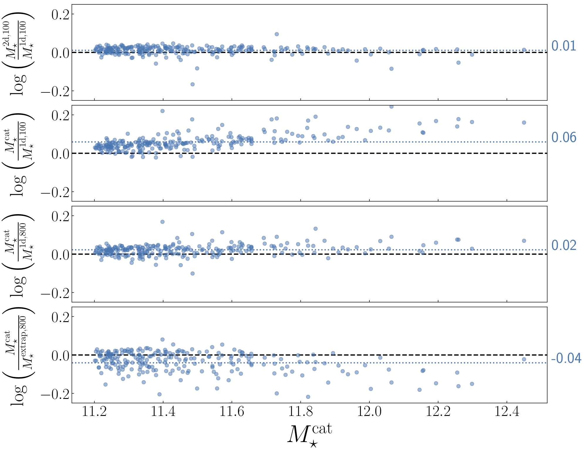

# Reaching for the Edge
A spinoff (Paper 2) of [HSC vs. hydro](https://github.com/f-ardila/HSC_vs_hydro).

**Project Goal**: Measuring "total" mass of galaxies. 

In [Paper 1](https://ui.adsabs.harvard.edu/abs/2021MNRAS.500..432A/abstract), we were measuring the stellar mass profiles of galaxies, which gives us mass at different radii. As a way to check our measurements, we wanted to compare our measurements to other mass definitions (see below). This lead us to ask questions about what is the "total" mass of a galaxy. We also noticed that some of our galaxies showed a falling off in their mass profile at very large radii (~800kpc) so we wondered if we were seeing the "edges" of galaxies. We learned from Benedikt that the FOF algorithm misses a lot of mass at large radii (>R500c) so we wanted to investigate this effect to see if that is what we are seeing.

## What we've done so far
- ### Measure different mass definitions

   - M\* cat ("catalog mass"): sum of all stellar particles bound (FOF) to the subhalo of the galaxy as given by the catalogs provided by Benedikt. We haves tested that including "fuzz" (unbounded particles) is only a negligible addition to M* cat. Hence for the reminder of this paper, we ignore unbound particles and consider M\* cat to be the total mass of the galaxy. In Illustris and TNG the stellar mass of each particle is given by the initial particle mass multiplied by a mass loss function for that particle.

   - M\* 1D, r ("1D mass"): mass derived from integrating mass density profile out to _r_ kpc. For example, M* 1D, 100 is derived from integrating mass density profile to 100 kpc. This is the mass measurement we compare with observations in [Paper 1](https://ui.adsabs.harvard.edu/abs/2021MNRAS.500..432A/abstract).
   
   - M\* 2D, r ("2D mass"): mass summed within an 2D elliptical aperture with a _r_ kpc semi-major axis on the 2D projected mass map assuming  a flux-weighted average isophotal shape.

   - M\* extrap ("extrapolated mass"): stellar mass enclosed in larger aperture inferred by extrapolating the 1D profile to 800 kpc using power-fit of the surface density profile between 50 and 100 kpc. This can be applied to real data as a better proxy of "total'' stellar mass.

- ### Check FOF bias
   - Benedikt sent some maps

## Next steps 
- Fitting a 2D Sersic model of the profile
   - Song's examples:
      - [Notebook](https://github.com/dr-guangtou/hsc_massive/blob/master/notebooks/simulation/tng_imfit_test.ipynb)
      - [Functions](https://github.com/dr-guangtou/hsc_massive/blob/master/notebooks/simulation/fit_tng.py)

## Other useful info
- [Overleaf draft](https://www.overleaf.com/project/5d126793ff8aa833ffaec43e)
